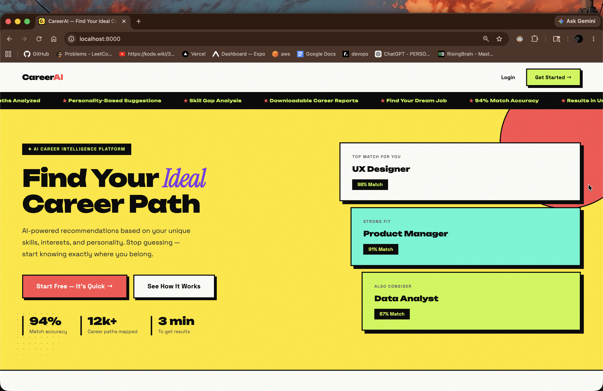
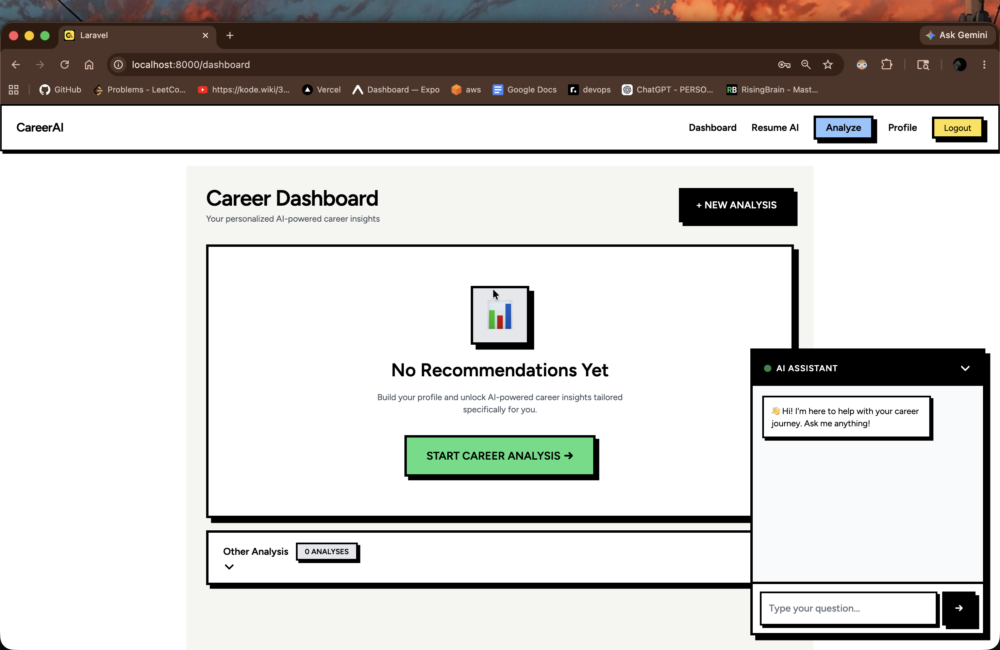
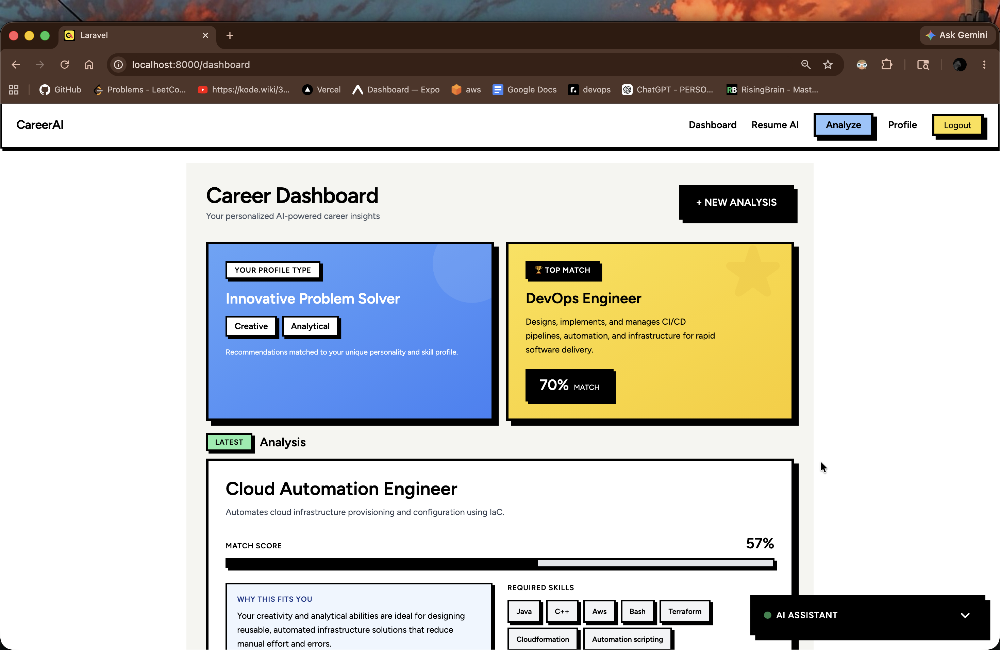
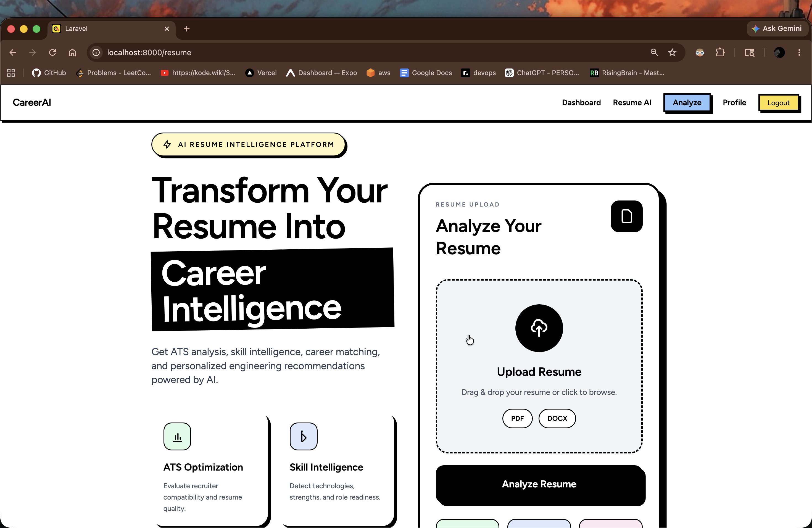
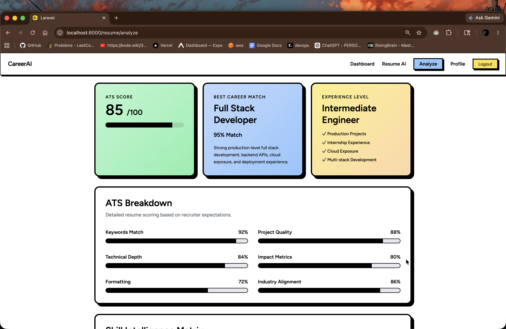
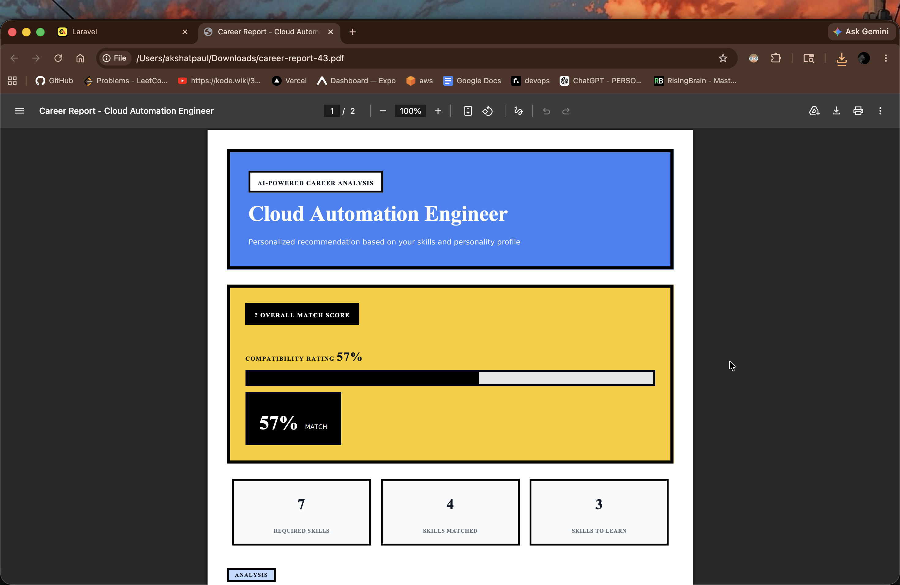

<div align="center">

# 🧠 AI Career Intelligence & Resume Optimization Platform

**An intelligent, full-stack SaaS platform that leverages Large Language Models to deliver personalized career guidance, ATS resume analysis, and skill-gap intelligence.**

[](https://php.net)
[](https://laravel.com)
[](https://tailwindcss.com)
[](https://mysql.com)
[](https://groq.com)
[](LICENSE)
[](CONTRIBUTING.md)

[Overview](#-overview) · [Features](#-core-features) · [Architecture](#-system-architecture) · [Installation](#-installation) · [API Docs](#-api-integration) · [Screenshots](#-screenshots)

---

</div>

## 📌 Overview

The **AI Career Intelligence Platform** is a production-grade, full-stack SaaS application that combines **structured prompt engineering**, **Groq LLM APIs**, and a **multi-stage resume intelligence pipeline** to deliver actionable, personalized career guidance at scale.

The platform ingests a user's academic background, technical skills, personality traits, and uploaded resume to produce:

- **AI-ranked career recommendations** with explainability
- **ATS compatibility scores** with targeted improvement suggestions
- **Skill-gap analysis** mapped to real career trajectories
- **Downloadable PDF career reports** with detailed analytics
- **Conversational career mentorship** via an LLM-backed chatbot

Unlike generic career tools, this platform implements a **weighted multi-factor scoring engine**, **strict JSON prompt contracts**, and **structured AI pipelines** — ensuring consistent, interpretable, and actionable outputs at every layer.

---

## ✨ Core Features

### 🎯 AI Career Recommendation Engine
- Generates ranked career path recommendations based on a composite profile
- Provides AI-authored "why this fits you" explanations per recommendation
- Maps required skills and learning milestones per career path
- Supports personality-aware suggestion tuning (MBTI-style trait mapping)

### 📄 ATS Resume Intelligence
- Parses PDF and DOCX resumes using `smalot/pdfparser` and `PHPWord`
- Scores ATS compatibility across formatting, keywords, and structure
- Extracts and cross-references skills against target job roles
- Identifies missing skills with prioritized improvement suggestions
- Outputs strengths/weaknesses with AI-written remediation notes

### 🧬 Personality Intelligence System
- Trait profiling via structured questionnaire
- Maps personality dimensions to career archetypes
- Informs the recommendation engine via weighted personality scoring

### ⚖️ Match Scoring Engine

```
Final Match Score = (0.70 × Skill Match Score) + (0.30 × Personality Match Score)
```

| Weight | Factor | Description |
|--------|--------|-------------|
| 70% | Skill Match | Overlap between user skills and career requirements |
| 30% | Personality Match | Alignment between trait profile and career archetype |

### 🤖 AI Career Mentor Chatbot
- Conversational interface powered by Groq LLM
- Context-aware career guidance and Q&A
- Suggests beginner roadmaps and learning paths
- Maintains session-level conversation history

### 📊 Dashboard Analytics
- Visual history of recommendation sessions
- Match percentage trends over time
- Skill coverage heatmaps and gap visualizations
- Exportable session data

### 📥 PDF Export System
- DomPDF-powered report generation
- Career analysis, skill-gap, and ATS reports
- Professional templates with branding support

---

## 🏗 System Architecture

### AI Recommendation Pipeline

```
┌─────────────────────────────────────────────────────────┐
│                     USER INPUT LAYER                     │
│   Skills · Interests · Personality Traits · Academics   │
└──────────────────────────┬──────────────────────────────┘
                           │
                           ▼
┌─────────────────────────────────────────────────────────┐
│               PROFILE PROCESSING ENGINE                  │
│   Trait Normalization · Skill Vectorization             │
│   Interest Clustering · Academic Weighting              │
└──────────────────────────┬──────────────────────────────┘
                           │
                           ▼
┌─────────────────────────────────────────────────────────┐
│              PROMPT ENGINEERING LAYER                    │
│   Structured System Prompts · JSON Schema Contracts     │
│   Personality Context Injection · Role Formatting       │
└──────────────────────────┬──────────────────────────────┘
                           │
                           ▼
┌─────────────────────────────────────────────────────────┐
│                   GROQ LLM API                          │
│   openai/gpt-oss-20b · Low-Latency Inference            │
│   Temperature-Tuned · Token-Budgeted Completions        │
└──────────────────────────┬──────────────────────────────┘
                           │
                           ▼
┌─────────────────────────────────────────────────────────┐
│            RESPONSE SANITIZATION LAYER                   │
│   JSON Extraction · Markdown Stripping                  │
│   Schema Validation · Fallback Handling                 │
└──────────────────────────┬──────────────────────────────┘
                           │
                           ▼
┌─────────────────────────────────────────────────────────┐
│             RECOMMENDATION RANKING ENGINE                │
│   Weighted Score Computation · Top-N Selection          │
│   Explainability Annotation · Persistence Layer         │
└──────────────────────────┬──────────────────────────────┘
                           │
                           ▼
┌─────────────────────────────────────────────────────────┐
│               DASHBOARD VISUALIZATION                    │
│   Career Cards · Match Percentages · Roadmaps           │
└─────────────────────────────────────────────────────────┘
```

### Resume Intelligence Pipeline

```
┌──────────────────────────────────────────┐
│            RESUME UPLOAD                 │
│       PDF / DOCX via HTTP POST           │
└──────────────────┬───────────────────────┘
                   │
                   ▼
┌──────────────────────────────────────────┐
│          DOCUMENT PARSING                │
│  smalot/pdfparser (PDF)                  │
│  PHPWord (DOCX)                          │
└──────────────────┬───────────────────────┘
                   │
                   ▼
┌──────────────────────────────────────────┐
│           TEXT CLEANING                  │
│  Encoding Normalization · Noise Removal  │
│  Section Boundary Detection              │
└──────────────────┬───────────────────────┘
                   │
                   ▼
┌──────────────────────────────────────────┐
│         AI ATS ANALYSIS                  │
│  Groq LLM · Structured JSON Prompt       │
│  Keyword Density · Format Compliance     │
└──────────────────┬───────────────────────┘
                   │
                   ▼
┌──────────────────────────────────────────┐
│         SKILL EXTRACTION                 │
│  Named Entity Recognition via LLM        │
│  Taxonomy Cross-Reference                │
└──────────────────┬───────────────────────┘
                   │
                   ▼
┌──────────────────────────────────────────┐
│       CAREER MATCH PREDICTION            │
│  Gap Analysis · Compatibility Scoring    │
│  Improvement Priority Ranking            │
└──────────────────┬───────────────────────┘
                   │
                   ▼
┌──────────────────────────────────────────┐
│          REPORT GENERATION               │
│  DomPDF · Branded Templates              │
│  Downloadable PDF Export                 │
└──────────────────────────────────────────┘
```

---

## 🛠 Technology Stack

### Backend

| Technology | Version | Purpose |
|-----------|---------|---------|
| PHP | 8.x | Core runtime |
| Laravel | 9.x | Application framework |
| Laravel Breeze | latest | Authentication scaffolding |
| Laravel Sanctum | latest | API token authentication |
| MySQL | 8.x | Relational data store |

### Frontend

| Technology | Purpose |
|-----------|---------|
| Blade Templates | Server-side rendering |
| TailwindCSS | Utility-first styling |
| Alpine.js | Reactive UI interactions |
| Vite | Asset bundling & HMR |

### AI & Intelligence Layer

| Technology | Purpose |
|-----------|---------|
| Groq API | High-throughput LLM inference |
| openai/gpt-oss-20b | Language model |
| Prompt Engineering | Structured JSON output contracts |
| JSON Schema Validation | AI response normalization |

### Processing & Export

| Library | Purpose |
|---------|---------|
| smalot/pdfparser | PDF text extraction |
| PHPWord | DOCX parsing and generation |
| DomPDF | PDF report rendering |

---

## 🗄 Database Schema

```
users
├── id, name, email, password, timestamps

profiles
├── id, user_id (FK), bio, education, experience
├── academic_score, personality_data (JSON), timestamps

skills
├── id, name, category, proficiency_level

interests
├── id, user_id (FK), category, weight, timestamps

user_skills (pivot)
├── user_id (FK), skill_id (FK), proficiency, timestamps

recommendations
├── id, user_id (FK), career_title, match_score
├── skill_match_score, personality_match_score
├── ai_explanation (JSON), roadmap (JSON)
├── required_skills (JSON), timestamps

skill_gaps
├── id, user_id (FK), recommendation_id (FK)
├── missing_skill, priority_level, resources (JSON), timestamps

resume_analyses
├── id, user_id (FK), filename, raw_text (TEXT)
├── ats_score, extracted_skills (JSON)
├── missing_skills (JSON), strengths (JSON)
├── weaknesses (JSON), suggestions (JSON), timestamps
```

**Relationship Summary:**
- `users` → `profiles`: One-to-One
- `users` → `recommendations`: One-to-Many
- `users` ↔ `skills`: Many-to-Many (via `user_skills`)
- `recommendations` → `skill_gaps`: One-to-Many
- `users` → `resume_analyses`: One-to-Many

---
```md id="y0d5j7"
## 📸 Screenshots

### 🏠 Landing Page



> AI-powered landing page showcasing personalized career intelligence, skill-gap analysis, and recommendation accuracy.

---

### 📊 Empty Dashboard State



> Initial dashboard state before recommendation generation with integrated AI mentor assistant.

---

### 📈 Career Intelligence Dashboard



> Personalized dashboard displaying match scores, personality alignment, required skills, and recommendation analytics.

---

### 📄 Resume Upload Interface



> Resume intelligence upload interface supporting PDF and DOCX parsing with ATS analysis.

---

### 🧠 ATS Resume Analysis Result



> AI-generated ATS scoring breakdown including keyword analysis, technical depth, industry alignment, and career compatibility.

---

### 📑 PDF Career Report Export



> Downloadable AI-generated career analysis report with match scoring and skill-gap insights.
```

---

## 🚀 Installation

### Prerequisites

| Requirement | Version |
|-------------|---------|
| PHP | >= 8.0 |
| Composer | >= 2.x |
| Node.js | >= 16.x |
| MySQL | >= 8.0 |
| Git | latest |

### Clone the Repository

```bash
git clone https://github.com/your-username/ai-career-intelligence.git
cd ai-career-intelligence
```

### Install PHP Dependencies

```bash
composer install
```

### Install Node Dependencies

```bash
npm install
```

### Environment Configuration

```bash
cp .env.example .env
php artisan key:generate
```

Edit `.env` with your configuration:

```env
APP_NAME="AI Career Intelligence Platform"
APP_ENV=local
APP_URL=http://localhost

DB_CONNECTION=mysql
DB_HOST=127.0.0.1
DB_PORT=3306
DB_DATABASE=career_intelligence
DB_USERNAME=root
DB_PASSWORD=your_password

GROQ_API_KEY=your_groq_api_key_here
GROQ_MODEL=openai/gpt-oss-20b
GROQ_API_BASE=https://api.groq.com/openai/v1
```

### Database Setup

```bash
mysql -u root -p -e "CREATE DATABASE career_intelligence;"
php artisan migrate
php artisan db:seed  # Optional: seed demo data
```

### Compile Frontend Assets

```bash
npm run dev       # Development (with HMR)
npm run build     # Production build
```

### Start the Development Server

```bash
php artisan serve
```

The application will be available at `http://localhost:8000`.

---

## 🐳 Docker Setup

```yaml
# docker-compose.yml
version: '3.8'

services:
  app:
    build: .
    ports:
      - "8000:8000"
    environment:
      - DB_HOST=db
      - GROQ_API_KEY=${GROQ_API_KEY}
    depends_on:
      - db

  db:
    image: mysql:8.0
    environment:
      MYSQL_DATABASE: career_intelligence
      MYSQL_ROOT_PASSWORD: ${DB_PASSWORD}
    volumes:
      - db_data:/var/lib/mysql

volumes:
  db_data:
```

```bash
docker-compose up -d
docker-compose exec app php artisan migrate
```

---

## 🔑 Environment Variables

| Variable | Required | Description |
|----------|----------|-------------|
| `APP_KEY` | ✅ | Laravel application key (auto-generated) |
| `DB_DATABASE` | ✅ | MySQL database name |
| `DB_USERNAME` | ✅ | MySQL username |
| `DB_PASSWORD` | ✅ | MySQL password |
| `GROQ_API_KEY` | ✅ | Groq API key for LLM inference |
| `GROQ_MODEL` | ✅ | Target model ID (e.g., `openai/gpt-oss-20b`) |
| `GROQ_API_BASE` | ✅ | Groq API base URL |
| `APP_ENV` | ✅ | `local`, `staging`, or `production` |
| `APP_DEBUG` | ✅ | `true` for development, `false` for production |

---

## 🔌 API Integration

### Groq LLM Integration

The platform communicates with the Groq API using structured prompt contracts that enforce JSON response schemas.

**Career Recommendation Request (Example)**

```php
// app/Services/AI/CareerRecommendationService.php

$payload = [
    'model' => config('services.groq.model'),
    'messages' => [
        [
            'role' => 'system',
            'content' => $this->buildSystemPrompt()
        ],
        [
            'role' => 'user',
            'content' => $this->buildUserPrompt($profile)
        ]
    ],
    'temperature' => 0.4,
    'response_format' => ['type' => 'json_object'],
];

$response = Http::withToken(config('services.groq.key'))
    ->post(config('services.groq.base_url') . '/chat/completions', $payload);
```

**Strict JSON Prompt Contract**

```
You are a career intelligence engine. Return ONLY a valid JSON object.
Schema:
{
  "recommendations": [
    {
      "career_title": string,
      "match_score": float (0-100),
      "skill_match_score": float,
      "personality_match_score": float,
      "required_skills": string[],
      "missing_skills": string[],
      "why_fit": string,
      "roadmap": string[]
    }
  ]
}
Do not include markdown, prose, or any text outside the JSON object.
```

**Response Sanitization**

```php
private function sanitizeAIResponse(string $raw): array
{
    // Strip markdown code fences if present
    $cleaned = preg_replace('/^```json\s*|\s*```$/m', '', trim($raw));

    // Decode and validate
    $decoded = json_decode($cleaned, true);

    if (json_last_error() !== JSON_ERROR_NONE) {
        throw new AIResponseException('Invalid JSON from AI response');
    }

    return $decoded ?? [];
}
```

---

## ⚖️ Match Scoring Logic

The scoring engine computes a normalized composite score for each career recommendation:

```php
// app/Services/Scoring/MatchScoringEngine.php

public function computeScore(array $userSkills, array $requiredSkills, array $personalityTraits): float
{
    $skillMatch = $this->computeSkillMatch($userSkills, $requiredSkills);
    $personalityMatch = $this->computePersonalityMatch($personalityTraits);

    return round((0.70 * $skillMatch) + (0.30 * $personalityMatch), 2);
}

private function computeSkillMatch(array $userSkills, array $required): float
{
    if (empty($required)) return 0.0;

    $matched = count(array_intersect(
        array_map('strtolower', $userSkills),
        array_map('strtolower', $required)
    ));

    return ($matched / count($required)) * 100;
}
```

**Score Interpretation:**

| Score Range | Interpretation |
|-------------|----------------|
| 85 – 100 | Excellent fit — strong alignment across skills and personality |
| 70 – 84 | Good fit — minor skill gaps, high personality alignment |
| 55 – 69 | Moderate fit — notable skill gaps, development recommended |
| Below 55 | Stretch goal — significant upskilling required |

---

## 📋 Resume Intelligence Pipeline

The resume analysis subsystem implements a multi-stage extraction and evaluation pipeline:

```php
// app/Services/Resume/ResumeIntelligenceService.php

public function analyze(UploadedFile $file): ResumeAnalysisResult
{
    // Stage 1: Parse document
    $rawText = $this->parser->extract($file);

    // Stage 2: Clean and normalize text
    $cleanedText = $this->cleaner->normalize($rawText);

    // Stage 3: AI ATS analysis via Groq
    $atsResult = $this->aiService->analyzeATS($cleanedText);

    // Stage 4: Skill extraction
    $skills = $this->aiService->extractSkills($cleanedText);

    // Stage 5: Career compatibility scoring
    $compatibility = $this->scoringEngine->computeResumeCompatibility($skills);

    // Stage 6: Persist and generate report
    return $this->reportBuilder->build($atsResult, $skills, $compatibility);
}
```

**ATS Analysis Output Schema:**

```json
{
  "ats_score": 78.5,
  "extracted_skills": ["Laravel", "MySQL", "REST APIs", "TailwindCSS"],
  "missing_skills": ["Docker", "Redis", "CI/CD pipelines"],
  "strengths": ["Strong keyword density", "Clear section headers"],
  "weaknesses": ["Missing quantified achievements", "No summary section"],
  "suggestions": [
    "Add measurable impact metrics to each role",
    "Include a professional summary targeting your target role",
    "Add Docker and containerization to your skills section"
  ]
}
```

---

## 📁 Project Structure

```
ai-career-intelligence/
├── app/
│   ├── Http/
│   │   ├── Controllers/
│   │   │   ├── CareerRecommendationController.php
│   │   │   ├── ResumeAnalysisController.php
│   │   │   ├── ChatbotController.php
│   │   │   ├── DashboardController.php
│   │   │   └── ProfileController.php
│   │   └── Middleware/
│   ├── Models/
│   │   ├── User.php
│   │   ├── Profile.php
│   │   ├── Recommendation.php
│   │   ├── ResumeAnalysis.php
│   │   └── SkillGap.php
│   └── Services/
│       ├── AI/
│       │   ├── CareerRecommendationService.php
│       │   ├── ResumeAIService.php
│       │   └── ChatbotService.php
│       ├── Resume/
│       │   ├── ResumeIntelligenceService.php
│       │   ├── PDFParser.php
│       │   └── DOCXParser.php
│       ├── Scoring/
│       │   └── MatchScoringEngine.php
│       └── Reports/
│           └── PDFReportBuilder.php
├── database/
│   ├── migrations/
│   └── seeders/
├── resources/
│   ├── views/
│   │   ├── dashboard/
│   │   ├── recommendations/
│   │   ├── resume/
│   │   └── chatbot/
│   ├── css/
│   └── js/
├── routes/
│   ├── web.php
│   └── api.php
├── config/
│   └── services.php
├── public/
├── storage/
│   └── resumes/
├── tests/
│   ├── Feature/
│   └── Unit/
├── .env.example
├── composer.json
├── package.json
└── README.md
```

---

## 🔮 Future Improvements

| Feature | Priority | Description |
|---------|----------|-------------|
| Job Board Integration | High | Live job matching via LinkedIn/Indeed APIs |
| Multi-LLM Support | High | Fallback chains across Groq, OpenAI, and Anthropic |
| Vector Embeddings | High | Semantic skill matching via pgvector or Pinecone |
| Resume Builder | Medium | AI-assisted resume creation with ATS optimization |
| OAuth Integration | Medium | Google and LinkedIn sign-in |
| Admin Analytics Panel | Medium | Platform-wide usage and model performance metrics |
| A/B Prompt Testing | Medium | Systematic prompt variant evaluation framework |
| API-first Mode | Low | Headless REST API for third-party integrations |
| Mobile App | Low | React Native or Flutter companion app |
| Multi-language Support | Low | i18n for global career markets |

---

## 🧪 Running Tests

```bash
# Run all tests
php artisan test

# Run with coverage report
php artisan test --coverage

# Run specific test suite
php artisan test --testsuite=Feature
php artisan test --testsuite=Unit
```

---

## 👥 Contributors

| Name | Role |
|------|------|
| [Akshat Paul](https://github.com/akshat2508) | Full-Stack Engineer & AI Systems Architect |

Contributions, issues, and feature requests are welcome. See [CONTRIBUTING.md](CONTRIBUTING.md) for guidelines.

---

## 📄 License

This project is licensed under the [MIT License](LICENSE).

---

<div align="center">

Built with Laravel · Groq LLM · TailwindCSS · structured intelligence pipelines

</div>
